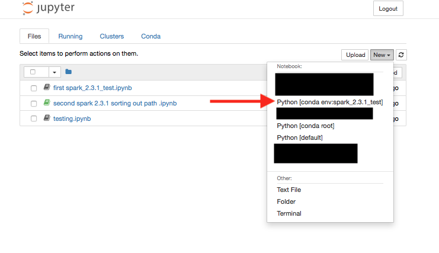
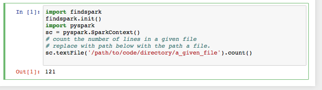

# SettingJupyterNotebookForPyspark


<a name="note02"></a>  Setting Jupyter Notebook for pyspark programming
-------------------------------------------------------------------------
**23 June 2018**

We often install local copies of [Spark](spark.apache.org) for experimentation and exploration. In particular, we do so when a new version of Spark is released. This small note describes how to set up the [Jupyter notebook](http://jupyter.org) to program in pyspark. I assume that you have already installed and configured Jupyter notebook. If not have a quick look at [Installing Jupyter](http://jupyter.org/install).

#### Installing spark

Download the version of the spark that you wish to work with from the [Download Apache Spark](https://spark.apache.org/downloads.html) page. I am downloading spark version 2.3.1.


We will end up with a ```.tgz``` file, extract the file in a suitable directory. I have saved the file
into a directory called ```/path/to/installation/dir/```.

```
tar -xzf spark-2.3.1-bin-hadoop2.7.tgz
```


 I am a mac/linux user and normally add the following lines to my .bash_profile to be able to invoke spark-shell and pyspark from my terminal.

```
alias spark-shell='/path/to/installation/dir/spark-2.3.1-bin-hadoop2.7/bin/spark-shell'
alias pyspark='/path/to/installation/dir/spark-2.3.1-bin-hadoop2.7/bin/pyspark'
```


#### Using Environments
To avoid collision between packages we will set up a conda environment. If you are not familiar with the Conda Environments check out [Managing Environment](https://conda.io/docs/user-guide/tasks/manage-environments.html). There is a short tutorial about using of [Conda and managment of conda  environments](https://conda.io/docs/user-guide/getting-started.html).

Follow these steps

Create an enviroment and give it a name of your choice.
Here we call it ```spark_2.3.1_test```.

```
conda create -n spark_2.3.1_test
```

Check to see if the environment is listed and then activate it.

```
conda env list
conda activate spark_2.3.1_test
```

Then install [ipykernel](https://anaconda.org/anaconda/ipykernel).

```
conda install ipykernel
python -m ipykernel install --name spark_2.3.1_test
```

Replace ```spark_2.3.1_test``` with the name of your environment.


We also need to install [findspark](https://anaconda.org/conda-forge/findspark).

```
conda install -c conda-forge findspark
```

Now your environment is ready for use. Move to the folder that you wish to
code at. Type ```jupyter notebook```. Create a new notebook using the
create environment as follows.



Write a step in the middle about choosing the environment in your Jupyter notebook
use findspark and use init() to access. The path is the address of the local version. 

```
import findspark
findspark.init("/path/to/installation/dir/spark-2.3.1-bin-hadoop2.7")
import pyspark
sc = pyspark.SparkContext() ...
```

Note, if you add ```SPARK_HOME``` into your ```.bash_profile``` you can simply
by not passing the path and  write ```findspark.init()```. Add the following lines to your ```.bash_profile```.

```
export SPARK_HOME=//path/to/installation/dir/spark-2.3.1-bin-hadoop2.7
export PATH=$SPARK_HOME/bin:$PATH
```



Have fun!

